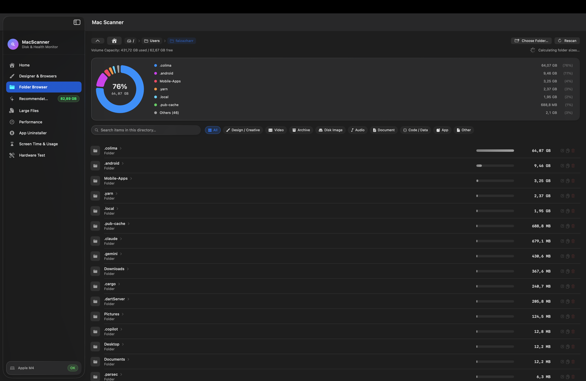
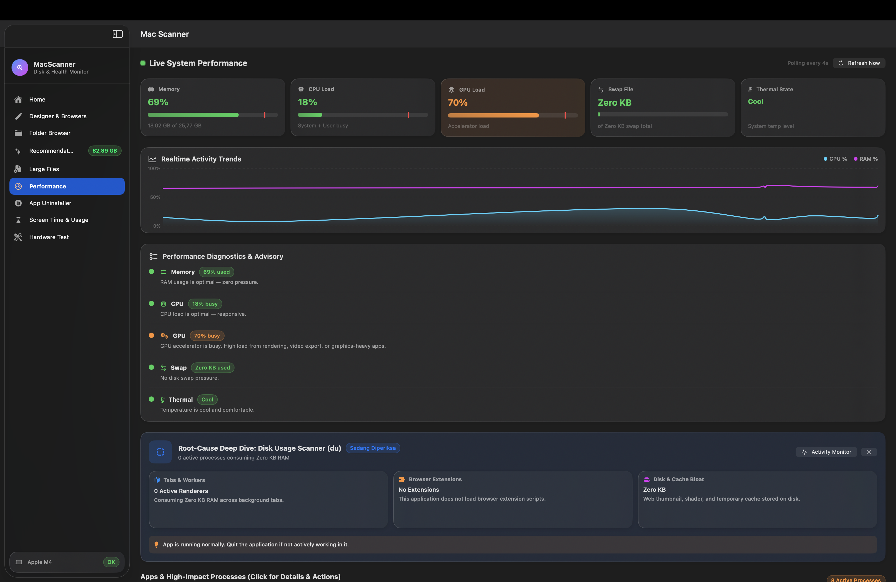
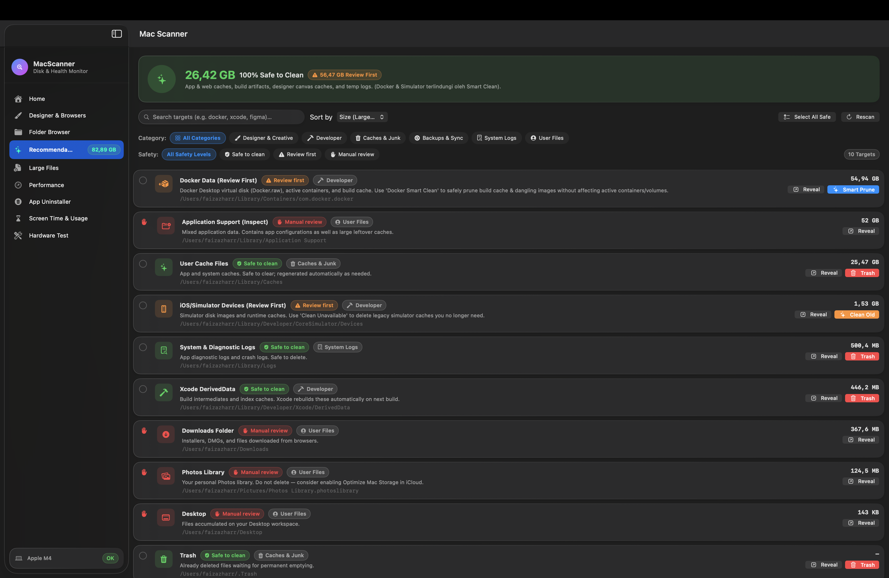
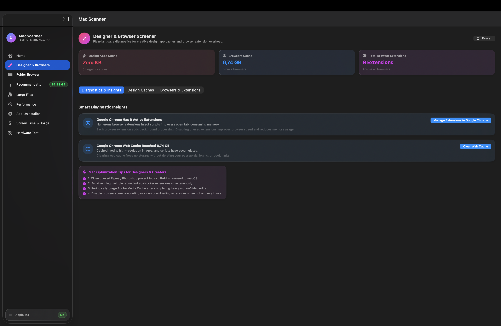
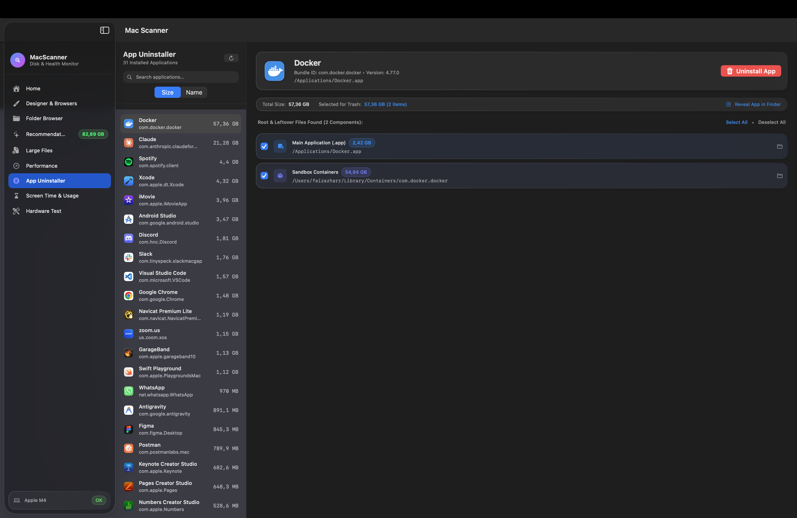
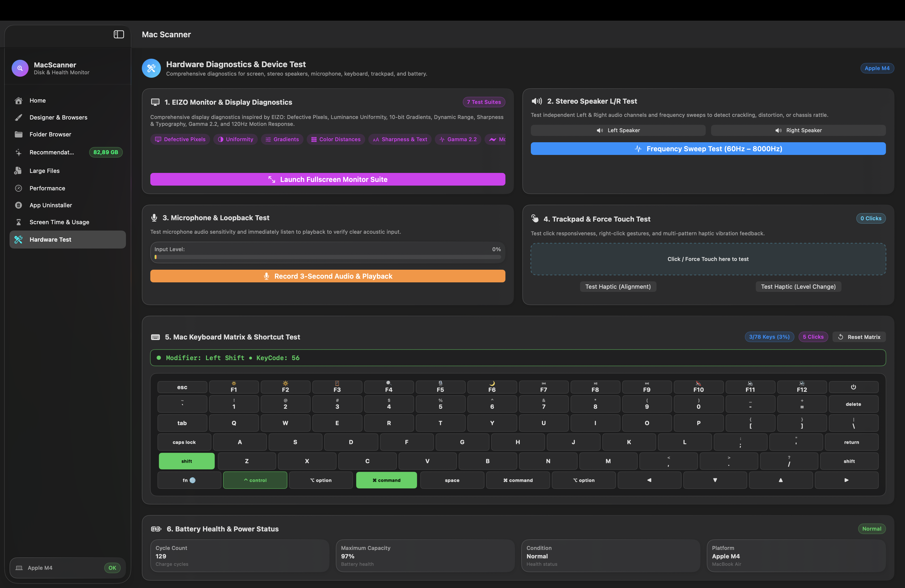
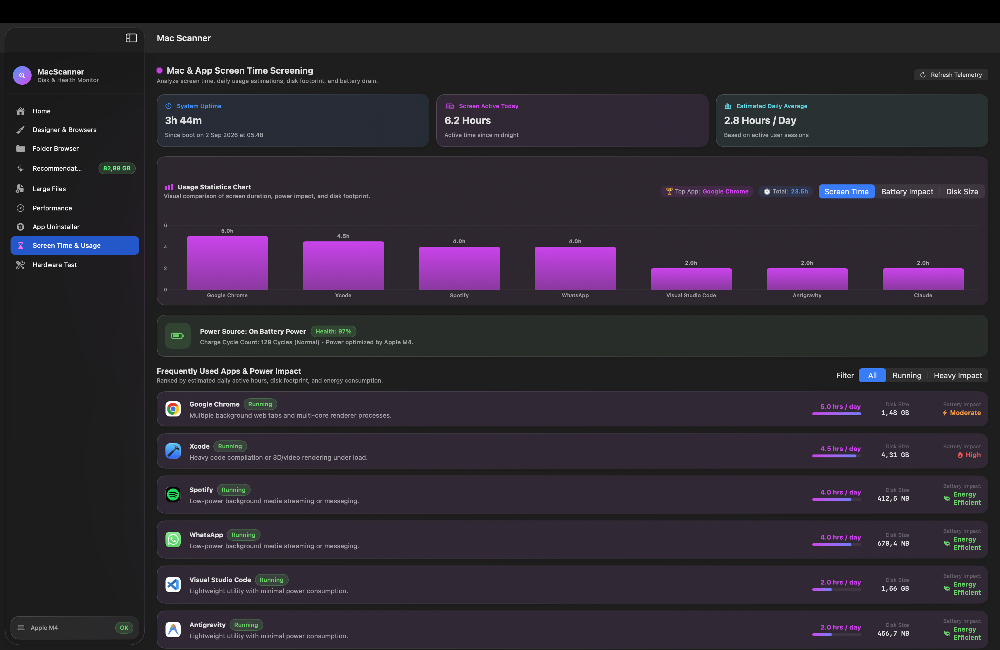

# MacScanner ⚡

  <strong>Native, Privacy-First System Screener & Hardware Diagnostics for macOS</strong> 
  <em>Lightweight (1.7 MB DMG), Universal 2 Binary (Apple Silicon + Intel), and 0% Background Overhead.</em>

  
  
  
  
  

---

## 🔒 Privacy & Zero-Data Collection Guarantee

> [!IMPORTANT]
> ### 🛡️ Official Developer Privacy Mandate
> **The developer DOES NOT COLLECT, HARVEST, TRACK, TRANSMIT, OR STORE ANY PRIVATE INFORMATION OR TELEMETRY** from users who install this application, nor from community members contributing to this project.
> - **100% On-Device Local Processing**: All disk analysis, leftover scans, memory/CPU/battery metrics, and hardware tests run strictly in local memory on your Mac.
> - **Zero Telemetry & No Remote Servers**: MacScanner does not connect to any cloud backend, contains zero tracking SDKs, and never phones home. What happens on your Mac stays on your Mac.

---

## 🚀 Visual Product Tour & Feature Showcase

### 🏠 1. System Health, Chipset & Hardware Topology

- **Instant Hardware Detection**: Identifies **Apple Silicon (M1/M2/M3/M4 Series)** and **Intel 64-bit Core/Xeon** processors with Performance vs. Efficiency core split.
- **Hardware Peripherals Check**: Real-time status for **Wi-Fi 6E/6 Interface**, **Bluetooth Controller**, and **Built-in Speaker System**.
- **Battery Health & Power Envelope**: Battery health percentage, cycle count, and condition (automatically switches to AC Power on Desktop Macs).
- **APFS Storage Ring**: Instant glanceable storage gauge calculating used vs free space.

---

### ⚡ 2. Real-Time Performance & Root-Cause Inspector

- **Zero-Footprint Telemetry**: Sub-millisecond Mach-kernel metrics for **RAM, CPU, GPU, Virtual Memory (Swap), and Thermal State** with 0.0% idle CPU overhead.
- **Context-Aware Non-Alarmist Health Engine**: Proportional memory evaluations that avoid false alarms during normal background swap activity.
- **Interactive Process Anatomy**: Click any running application to inspect worker threads, GPU renderers, and web caches with one-click actions for **Inspect**, **Clear Cache**, and **Force Quit**.

---

### 🧹 3. Smart Cleanup Recommendations

- **Developer & System Junk Cleanups**: One-click safe cleanup targets for **Xcode DerivedData**, **Docker VM data**, **iOS Simulator caches**, **User logs**, and **Trash**.
- **100% Reversible Deletions**: Deletions strictly use the native macOS Trash (`FileManager.trashItem`).

---

### 🎨 4. Designer & Browser Bloat Screener

- **Tailored for Creators & Developers**: Identifies oversized cache footprints from **Figma, Adobe Creative Cloud (Photoshop, Illustrator, Premiere, After Effects), Sketch, Chrome, Safari, Brave, Arc, and Firefox**.
- **Safe Cache Purging**: Removes stale assets without deleting user project files, artboards, or browser login sessions.

---

### 🗑️ 5. Deep Root App Uninstaller & Leftover Cleaner

- **Full Application Lifecycle Management**: Discovers all installed application bundles and uncovers hidden leftovers across `~/Library/Application Support`, `Caches`, `Containers`, `Group Containers`, `Logs`, and `LaunchAgents`.
- **Instant Pre-Calculated Sizing**: Concurrently calculates disk footprints without locking the UI.
- **Self-Uninstall Protection**: Built-in safeguards prevent accidental deletion of MacScanner itself.

---

### 🛠️ 6. Hardware Diagnostics & Display Test Suite

- **7-Module Display Calibration Suite**:
  1. **Defective Pixels**: Pure primaries and secondaries for dead/stuck pixel inspection.
  2. **Luminance Uniformity**: 25%, 50%, 75%, 100% full-field luminance tests.
  3. **10-Bit Color Gradients**: Continuous linear gradients to test color banding.
  4. **Dynamic Range & Color Distances**: Near-black (1%–10%) and near-white (90%–99%) matrices.
  5. **Sharpness & Typography**: Micro-line grids and multi-scale Retina typography.
  6. **Gamma 2.2 Calibration**: Optical blending checkerboards and grayscale ramps.
  7. **120Hz ProMotion Motion Response**: Animated high-framerate pursuit blocks.
- **Peripherals Testing**: Independent stereo speaker L/R audio sweeps, microphone input meter, isolated keyboard matrix tester, and trackpad haptic canvas.

---

### ⏱️ 7. Screen Time & Digital Wellness Analytics

- **App Screen Time Metrics**: Real-time tracking of active daily hours, system uptime, and launch frequency.
- **Swift Charts Analytics**: Interactive chart visualizations comparing **Screen Time**, **Battery Impact**, and **Disk Space**.

---

## 💻 Supported Devices & Hardware Compatibility

MacScanner is built with an **intelligent hardware-adaptive engine** that dynamically scales memory algorithms, thermal diagnostics, and interface densities for every Mac model:

| Device Family | Models Supported | Cooling & Thermal Profile | Memory & Storage Scaling |
|---|---|---|---|
| **MacBook Air** | 13" & 15" (M1, M2, M3, Intel) | **Fanless Laptop** (Passive Aluminum Cooling) | Dynamic Swap `< 25% RAM`, Proactive Memory Optimization |
| **MacBook Pro** | 13", 14", 15", 16" (M1/M2/M3/M4 Pro & Max, Intel) | **Active Fan Laptop** (Dual Cooling Fans) | High Multitasking Headroom (16 GB – 128 GB+) |
| **Mac mini** | All Generations (M1, M2, M2 Pro, Intel) | **Desktop Workstation** (Continuous AC Power) | Headroom-Aware Desktop Telemetry |
| **Mac Studio** | All Generations (M1 Max/Ultra, M2 Max/Ultra) | **High Thermal Headroom** (Massive Heatsinks) | Workstation-Class Scaling (32 GB – 192 GB+) |
| **iMac** | 24" (M1, M3, M4), 21.5" & 27" 4K/5K Retina (Intel) | **All-in-One Desktop** (Continuous AC Power) | Retina Display Calibration & Diagnostics |
| **Mac Pro** | Tower & Rack (Apple Silicon Ultra, Intel Xeon) | **Workstation Server** (Full PCIe & NVMe APFS) | Heavy Dataset & Multi-TB Storage Profiles |

### 📋 Minimum System Requirements:
- **Operating System**: macOS 13.0 (Ventura), macOS 14.0 (Sonoma), macOS 15.0 (Sequoia), or later.
- **Architecture**: Native Apple Silicon (`arm64`) & Intel 64-bit (`x86_64`) Universal Binary.
- **Memory (RAM)**: 8 GB, 16 GB, 18 GB, 24 GB, 32 GB, 36 GB, 48 GB, 64 GB, 96 GB, 128 GB, 192 GB+.
- **Storage**: 128 GB to 8 TB+ APFS SSDs.

---

## 📦 Installation & Download

**[⬇ Download Latest MacScanner.dmg](../../releases/latest)**

1. Download and open **`MacScanner.dmg`**.
2. Drag **MacScanner.app** into your **Applications** folder.
3. Open the app and grant Full Disk Access when prompted for complete root cleaning capabilities.

---

## 🤝 Contributor Guidelines & Standards

We welcome open-source contributions! To ensure MacScanner remains lightweight, robust, and safe, all contributors must strictly adhere to the following standards:

1. **Strict Zero-Telemetry Policy**:
   - PRs must **NEVER** introduce external tracking, third-party analytics SDKs, or network telemetry requests.
2. **SOLID & Single-Event Driven (UDF) Architecture**:
   - Separate concerns across protocols in [`Sources/MacScanner/Core/Protocols/ServiceProtocols.swift`](Sources/MacScanner/Core/Protocols/ServiceProtocols.swift).
   - All state mutations must flow through unidirectional action dispatches (`send(_ action:)`).
   - Use dependency injection (`init(service: ...)`) for all ViewModels.
3. **Zero-Bloat & Ultra-Lightweight Footprint**:
   - Keep the binary size minimal (compiled with `-Osize` and symbol stripping).
   - Never spawn unnecessary CLI sub-processes when native Darwin/Mach APIs are available.
   - Stop background polling timers immediately when views disappear (`appear`/`disappear` lifecycle).
4. **Safety First (Reversible Deletions)**:
   - Always use `FileManager.default.trashItem` for file cleanups. Never use `rm -rf` or permanent deletion APIs.
5. **Code Style & Concurrency**:
   - Swift 6 strict concurrency compliance (`@MainActor` for UI, `Task.detached` for heavy I/O).
   - Format code cleanly and verify with `swiftlint`.

For detailed developer workflows and setup instructions, see [**`CONTRIBUTING.md`**](CONTRIBUTING.md) and [**`RELEASING.md`**](RELEASING.md).

---

## 🚀 Release & Semantic Versioning

For instructions on publishing releases via Git tags, see [**`RELEASING.md`**](RELEASING.md).

---

## 📄 Copyright

Copyright © 2026 **Faiz Azhar Ristya Nugraha**. All rights reserved.
